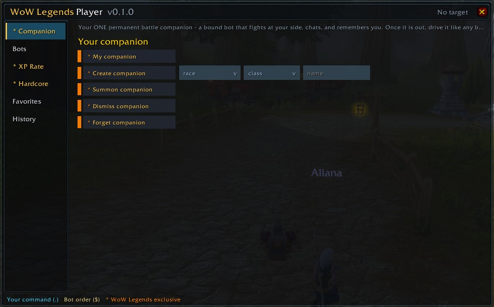
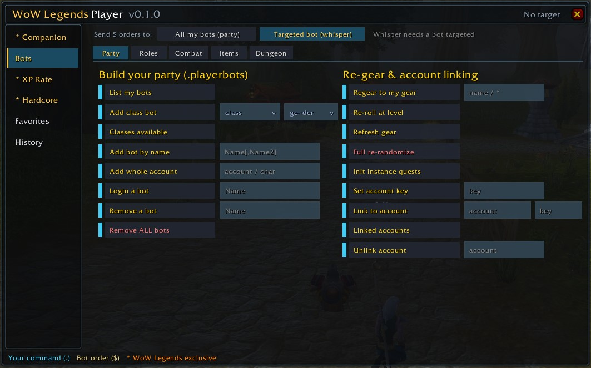

# WoW Legends — Player Addon

[](https://github.com/WOWLegendsHQ/wow-legends-player-addon/releases/latest)
[](https://github.com/WOWLegendsHQ/wow-legends-player-addon/releases)
[](https://wow-legends.eu)
[](LICENSE)

In-game player toolkit for **[WoW Legends](https://wow-legends.eu/)** (WotLK 3.3.5a / AzerothCore). Build and command a party of AI bots, set their roles, run dungeons, tune your own XP rate, manage your personal Companion and opt into Hardcore — every command one click away, with input fields and dropdowns right next to it.

> **Made for the [WoW Legends](https://wow-legends.eu/) repack** — a free, self-hosted Wrath of the Lich King (3.3.5a) world with hundreds of AI-driven bots, an AI companion that chats back, hardcore mode, and a one-click installer. Get the server and client at **[wow-legends.eu](https://wow-legends.eu/)**.

### ⬇ [Download the latest release](https://github.com/WOWLegendsHQ/wow-legends-player-addon/releases/latest/download/WoWLegendsPlayer.zip)

It shares its look and feel with the **[GM addon](https://github.com/WOWLegendsHQ/wow-legends-gm-addon)** — same left menu + top tabs, same widgets and colours. The addon only ever *sends your own commands*: it needs **no special permissions** and never elevates anything.

---

## Screenshots


*The ★ Companion tab — your one permanent battle companion, created with race and class dropdowns.*


*The Bots tab — build your party with `.playerbots`, then command it with one-click `$` orders.*

---

## Highlights

- **★ Companion** — your ONE permanent battle companion that fights at your side, chats, and remembers you. Create it with race and class dropdowns, then drive it like any bot.
- **PlayerBot command center** — build a party (`.playerbots`), then command your bots with one-click `$` orders (movement, combat, roles/specs, gear, loot) through a **Party / Whisper** scope switch, plus a guided **Dungeon** run flow.
- **Your own XP rate** — a 1–10 slider sets how fast you level: 1 = Blizzlike, up to the server's cap.
- **Hardcore** — opt a level-1 character into permadeath (with a loud confirm), and challenge other hardcore players to lethal **Mak'gora** duels.
- **Quality of life** — current-target readout, danger-command confirmations, favorites, command history, a draggable panel + launcher, dropdowns for fixed choices (race, class, gender, roll, raid icon, …), and remembered input values.

---

## Install

1. Download **[`WoWLegendsPlayer.zip`](https://github.com/WOWLegendsHQ/wow-legends-player-addon/releases/latest/download/WoWLegendsPlayer.zip)**.
2. Extract the `WoWLegendsPlayer` folder into your client's AddOns directory:
   ```
   World of Warcraft\Interface\AddOns\WoWLegendsPlayer\
   ```
   The path `…\Interface\AddOns\WoWLegendsPlayer\WoWLegendsPlayer.toc` must exist.
3. Launch the game and enable **WoW Legends Player** on the character-select AddOns screen.
4. Log in. Click the button by the minimap, or type **`/wlp`** (also `/bots`, `/wlplayer`).

---

## Two command types

WoW Legends bots respond to **two** kinds of command, and the addon sends each one correctly:

| Type | Prefix | Sent as | Example |
|------|--------|---------|---------|
| **Dot-command** | `.` | chat line | `.xp set 5`, `.companion create orc warrior Grom` |
| **Bot order** | `$` | whisper to a bot, or party/raid chat for all your bots | `$follow`, `$attack`, `$talents spec arms` |

A plain (no-`$`) whisper to a bot is **AI chat** — the bot talks back in character, it is *not* an order. The **Bots** tab has a scope selector — *All my bots (party)* or *Targeted bot (whisper)* — so every `$` order goes to the right place.

---

## Tabs

| Tab | What's inside |
|---|---|
| **★ Companion** | Your permanent battle companion: status, summon / dismiss / forget, and a faction-aware Create row with race + class dropdowns |
| **Bots** | Party builder (`.playerbots`), `$` orders, roles / specs, gear & loot, and the dungeon-run flow — with a **Party / Whisper** scope switch. Sub-tabs: Party · Roles · Combat · Items · Dungeon |
| **★ XP Rate** | A 1–10 slider + view / enable / disable / reset for your personal XP rate |
| **★ Hardcore** | Opt into permadeath (`.hardcore on`, with a permadeath confirm) and Mak'gora duels |
| **Favorites** / **History** | Pinned commands, and the last commands you sent (click to re-run) |

Sections automatically use one or two columns based on their content.

---

## How to use

| Action | Result |
|---|---|
| **Click** a command | Runs it with the values in the input fields |
| **Enter** in a field | Runs that row |
| **Hover** a command | Shows the exact line, its help, and whether it's your command (`.`) or a bot order (`$`) |
| **Shift-click** | Drops the built command into the chat box to edit before sending |
| **Right-click** | Pin / unpin to **Favorites** |
| **Shift-drag** the minimap button | Move the launcher |

A coloured pip on each row shows the kind of command: cyan = your command (`.`), tan = a bot order (`$`), orange ★ = a WoW Legends exclusive (Companion / XP / Hardcore). Destructive actions (remove all bots, forget companion, Mak'gora, Hardcore) ask for confirmation first; Hardcore gets its own permadeath warning. The header shows your current **target**, since several actions fall back to it when a name field is blank.

### Slash commands

`/wlp` (also `/bots`, `/wlplayer`) toggles the panel. Sub-commands: `reset` (recenter panel + button), `show` / `hide`, `debug` (module load status).

---

## Compatibility

- WoW client **3.3.5a** (interface `30300`). It will not load on other clients without changing the TOC.
- Built for **AzerothCore** (the WoW Legends Playerbot branch). Commands are sent as ordinary chat; the server intercepts dot-commands before broadcasting them.
- No external libraries — only the stock 3.3.5a UI API.
- Panels cover the player and PlayerBot command set only — GM-only commands are intentionally excluded.

## Credits

Built for [WoW Legends](https://wow-legends.eu/). Runs on [AzerothCore](https://www.azerothcore.org/) and the [mod-playerbots](https://github.com/liyunfan1223/mod-playerbots) project.

## License

[MIT](LICENSE).
